class: middle, center, title-slide

# Foundations of Data Science

Lecture 3: Visualization

<br><br>
Prof. Gilles Louppe<br>
[g.louppe@uliege.be](g.louppe@uliege.be)

???

https://badriadhikari.github.io/data-viz-workshop-2021/

---

class: middle

# Encoding data with visual cues

---

class: middle

<span style="font-size: 5em;" class="center">14, 37, 75</span>

<br>

.question[In pairs, try to come up with as many representations/encodings of this "data".]

---

class: middle

## Visual cues

Visual cues are elements of a visualization that encode data. They are expressed as marks and channels:
- A .bold[mark] is geometric primitive such as point, line, area, or volume.
- A .bold[channel] is an attribute of a mark that can be used to encode data, such as position, size, shape, or color.

<br><br>
.center.width-100[<br>Marks are geometric primitives.]

.footnote[Credits: T. Munzner, "Visualization Analysis and Design", 2014.]

---

class: middle

.center.width-100[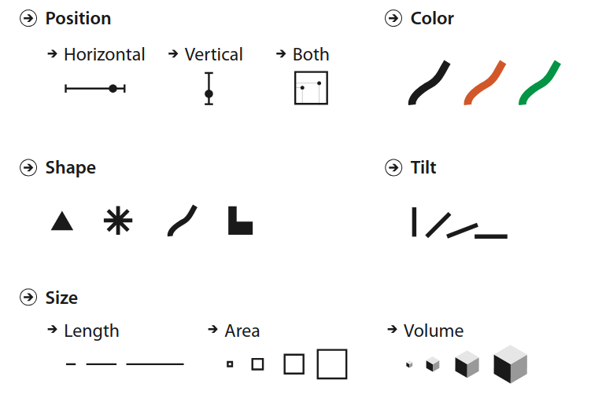<br>Visual channels control the appearance of marks.]

.footnote[Credits: T. Munzner, "Visualization Analysis and Design", 2014.]

---

class: middle

.center.width-100[]

(a) Bar charts encode data using line marks, controlled by a vertical position channel (height) and a horizontal position channel (category).
(b) Scatterplots encode data using point marks, controlled by two position channels (x and y).
(c) A third variable can be encoded using a color channel.
(d) A fourth variable can be encoded using a size channel (area of the point).

.footnote[Credits: T. Munzner, "Visualization Analysis and Design", 2014.]


---

class: middle

## Perceptual hierarchy

Data can be encoded through a variety of visual channels. However, not all channels are equally effective for conveying information.

.center.width-50[]

.footnote[Credits: T. Munzner, "Visualization Analysis and Design", 2014.]

---

class: middle

Cleveland and McGill (1984) conducted experiments to evaluate the accuracy of visual channels for encoding quantitative data.

.center.width-80[]

.footnote[Credits: T. Munzner, "Visualization Analysis and Design", 2014.]

---

class: middle

## Coordinate systems

Before mapping (numerical) data to visual channels, it is important to choose an appropriate coordinate system as it affects the perception and effectiveness of the visualization.
- .bold[Cartesian coordinates]: intuitive and effective for most data types.
- .bold[Polar coordinates]: useful for cyclic data (e.g., time of day, seasons), but can distort perception of lengths.

---

class: middle, black-slide

.center.width-45[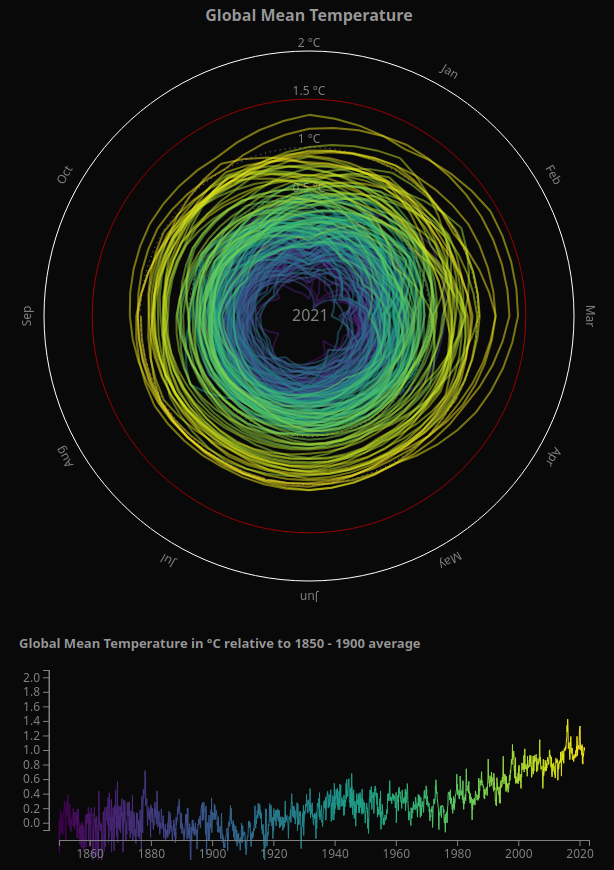]

.center[Climate spiral vs. line chart showing global mean temperature change over time.]

.footnote[Credits: [Open climate data](https://openclimatedata.net/climate-spirals/temperature-line-chart/), adapted from Ed Hawkins' climate spiral.]


---

class: middle

## Scales and transformations

Sometimes, data spans several orders of magnitude or has a skewed distribution. In such cases, applying a transformation or using a different scale can improve the interpretability of the visualization.
- .bold[Linear scale]: preserves the original data values.
- .bold[Logarithmic scale]: useful for data spanning several orders of magnitude.
- .bold[Quantile scale]: divides data into equal-sized bins, useful for skewed distributions.

---

class: middle

.center.width-70[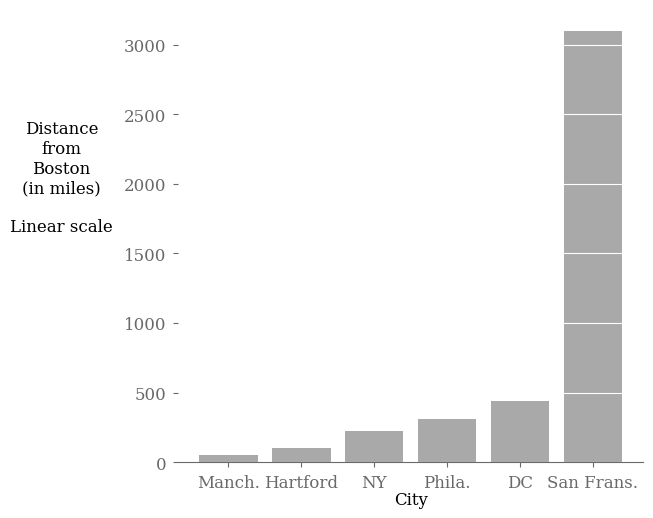]

.center[Linear scales can be dominated by large values, dwarfing smaller values and making it hard to see small variations.]

.footnote[Data source: [Effective data visualization](https://badriadhikari.github.io/data-viz-workshop-2021/log/), USML, 2021.]

---

class: middle

.center.width-70[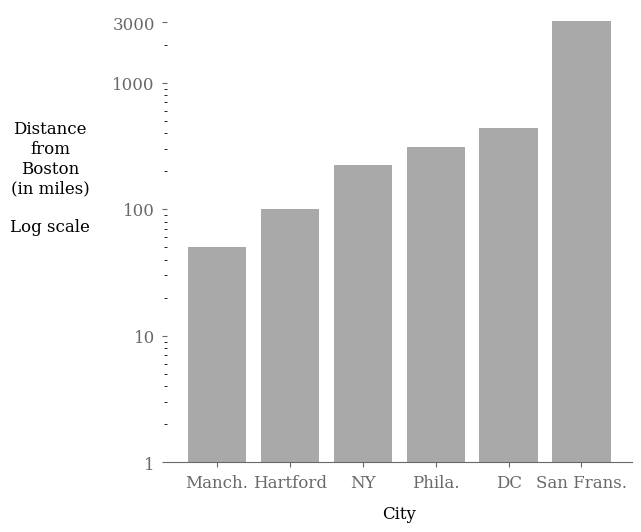]

.center[Showing data on a logarithmic scale can prevent large values from dominating the visualization and reveal patterns among smaller values.]

.footnote[Data source: [Effective data visualization](https://badriadhikari.github.io/data-viz-workshop-2021/log/), USML, 2021.]

---

class: middle

## Colors

Color is a powerful channel for encoding categorical and quantitative data.

The primary representation system is the Hue, Saturation, Value (HSV) model:
- .bold[Hue]: the type of color (e.g., red, green, blue), numerically represented as an angle on the color wheel (0-360 degrees).
- .bold[Saturation]: the intensity or purity of the color (from gray to full color), represented as a percentage (0-100%).
- .bold[Value]: the brightness of the color (from black to full brightness), represented as a percentage (0-100%).

---

class: middle

.center.width-100[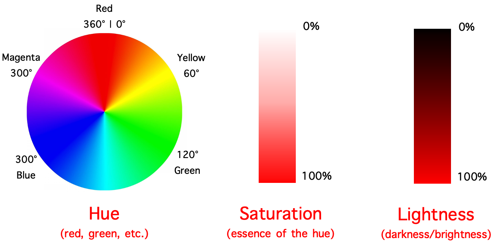]

.footnote[Data source: [Effective data visualization](https://badriadhikari.github.io/data-viz-workshop-2021/colors/), USML, 2021.]

---

class: middle

A colormap specifies a mapping between data values and colors. There are three main types of colormaps:
- .bold[Sequential colormaps]: vary smoothly from light to dark colors, often using a single hue; should be used for representing ordered data.
- .bold[Diverging colormaps]: vary smoothly between two different hues, with a neutral color in the middle; should be used for representing ordered data with a critical midpoint.
- .bold[Categorical colormaps]: consist of distinct colors; should be used for representing categorical data without inherent ordering.

---

class: middle

.center[.
.width-45[]

.width-45[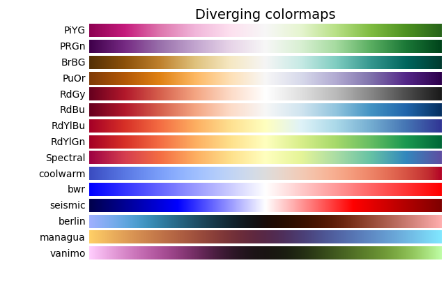]
.width-45[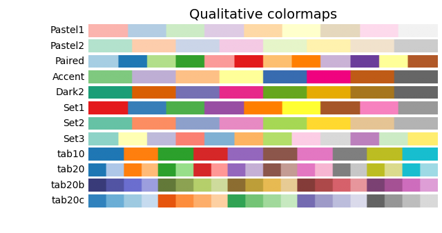]
]

---

class: middle

.center.width-10[]

.alert[Color vision deficiency affects approximately .bold[1 in 12 men] and .bold[1 in 200 women] worldwide. .bold[Color is not a reliable channel for encoding information].] 

---

class: middle

.center.width-90[]

Perceptually uniform colormaps ensure that equal steps in data are perceived as equal steps in color. They should be preferred over non-uniform colormaps (jet, rainbow) that can mislead interpretation.

---

class: middle

Finally, colors can also be used to .bold[draw attention] to specific elements in a visualization, such as highlighting important data points or trends.

.center.width-60[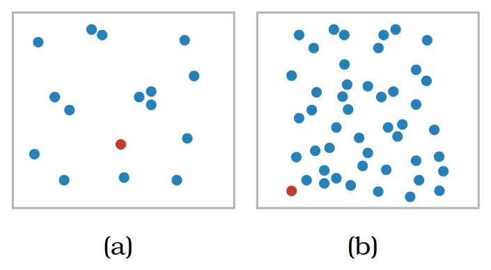]

.footnote[Credits: T. Munzner, "Visualization Analysis and Design", 2014.]

---

class: middle

# Anti-patterns 

---

class: middle

.center.width-60[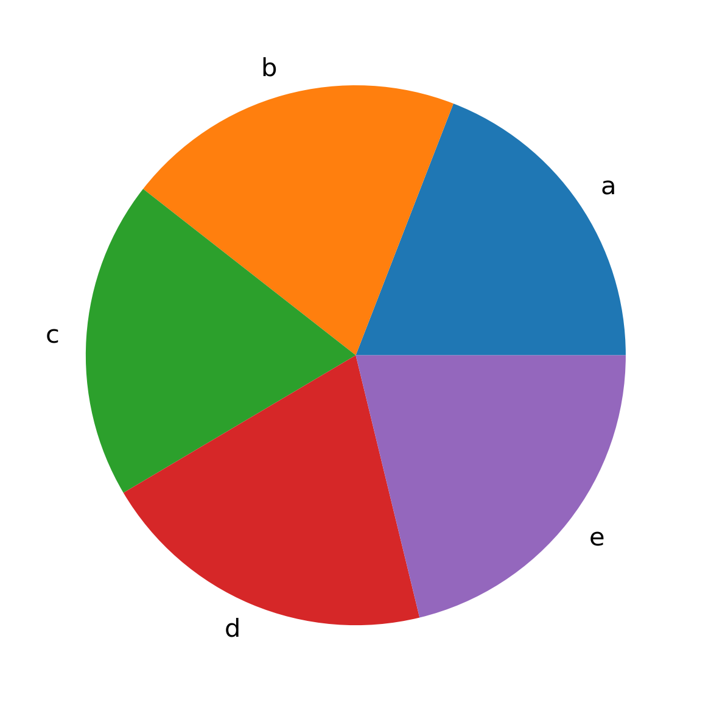]

.center[What category is the largest?]

---

class: middle

.center.width-60[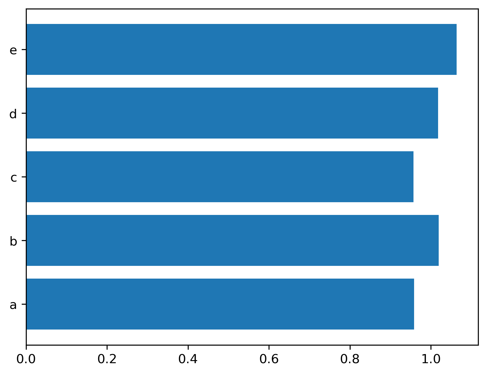]

.center[Same data! .bold[Lengths and positions are easier to compare] than angles and areas.]

---

class: middle

.center.width-60[]

.center[.bold[Do not exaggerate reality] by truncating axes or using misleading aspect ratios.]

.footnote[Credits: John Muyskens, [Most of Trump's charts skew the data](https://www.washingtonpost.com/graphics/politics/2016-election/trump-charts/), The Washington Post, 2016.]

---

class: middle

.grid[
.kol-1-2[.center.width-65[]]
.kol-1-2[.center.width-65[]]
]

.footnote[Credits: John Muyskens, [Most of Trump's charts skew the data](https://www.washingtonpost.com/graphics/politics/2016-election/trump-charts/), The Washington Post, 2016.]

---

class: middle

.center.width-60[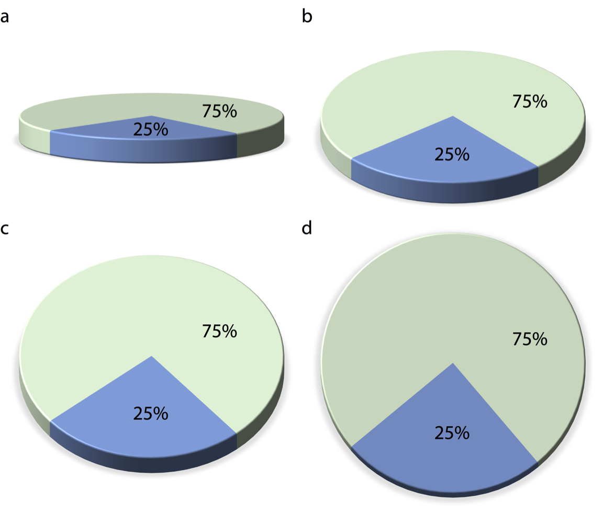]

.center[.bold[Do not go for 3d. Ever.] It distorts perception and adds unnecessary complexity.]

.footnote[Credits: Claus O. Wilke, [Fundamentals of Data Visualization](https://clauswilke.com/dataviz/), 2019.]

---

class: middle

.center[
.width-45[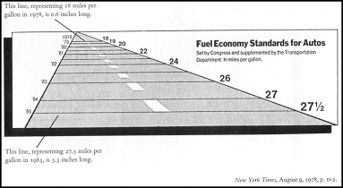] .width-45[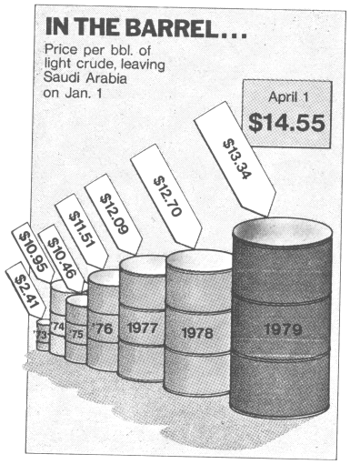]
]

.center[.bold[Do not lie.] Use visual channels that accurately represent the data.]

.footnote[Credits: David Giard, [Data visualization](https://davidgiard.com/data-visualization-part-3-graphical-integrity).]

---

class: middle

.center[<video controls preload="auto" height="480" width="640">
  <source src="./figures/lec3/dataink.mp4" type="video/mp4">
</video>]

.center[.bold[Maximize the data-ink ratio] by removing unnecessary elements.]

.footnote[Credits: Joey Cherdarchuk, [Data looks better naked](https://www.darkhorseanalytics.com/blog/data-looks-better-naked).]

???

Antoine de Saint-Exupéry: "Perfection is achieved, not when there is nothing more to add, but when there is nothing left to take away."

---

class: middle

.smaller-x.center[
```
   dataset   mean_x   mean_y     sd_x     sd_y         cor
      away 54.26610 47.83472 16.76982 26.93974 -0.06412835
  bullseye 54.26873 47.83082 16.76924 26.93573 -0.06858639
    circle 54.26732 47.83772 16.76001 26.93004 -0.06834336
      dino 54.26327 47.83225 16.76514 26.93540 -0.06447185
      dots 54.26030 47.83983 16.76774 26.93019 -0.06034144
   h_lines 54.26144 47.83025 16.76590 26.93988 -0.06171484
high_lines 54.26881 47.83545 16.76670 26.94000 -0.06850422
slant_down 54.26785 47.83590 16.76676 26.93610 -0.06897974
  slant_up 54.26588 47.83150 16.76885 26.93861 -0.06860921
      star 54.26734 47.83955 16.76896 26.93027 -0.06296110
   v_lines 54.26993 47.83699 16.76996 26.93768 -0.06944557
wide_lines 54.26692 47.83160 16.77000 26.93790 -0.06657523
   x_shape 54.26015 47.83972 16.76996 26.93000 -0.06558334
```
]

.center[.bold[Do not summarize the data without visualizing it.]<br> The Datasaurus dozen: 13 datasets with identical summary statistic.]

---

class: middle

.center.width-90[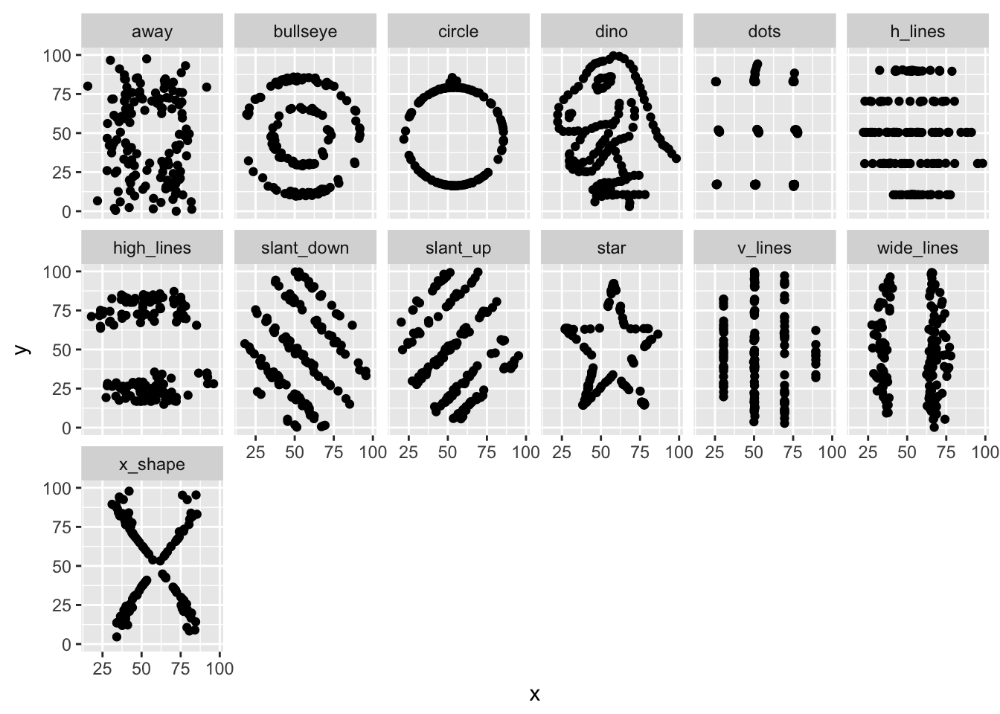]

.center[Summary statistics can be misleading. .bold[Always visualize the rawest data]!]

---

class: middle

# Choosing the right plot

---

class: center, middle, black-slide

<iframe width="600" height="400" src="https://www.youtube.com/embed/6lm4wJ1qm0w" frameborder="0" allowfullscreen></iframe>

Jean-Luc Doumont, "Choosing the right graph", 2017.

---

class: middle

## Key takeaways
- Visualize data using the most perceptually effective channels (positions, lengths)
- Use appropriate coordinate systems and scales to enhance interpretability.
- Choose colormaps that accurately represent the data and are accessible to all viewers.
- Avoid common pitfalls such as 3D effects, misleading axes, and unnecessary complexity.

---

class: middle

## The bottom line

A good plot is one that effectively communicates the underlying data and insights to the audience. It should be clear, accurate, and visually appealing, while avoiding unnecessary complexity or distortion of the data. 

---

class: end-slide, center
count: false

The end.
