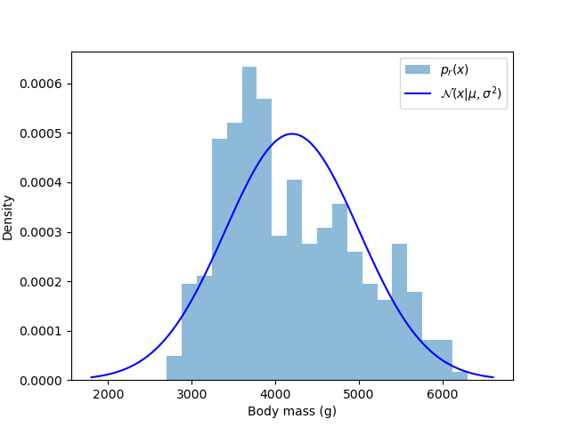
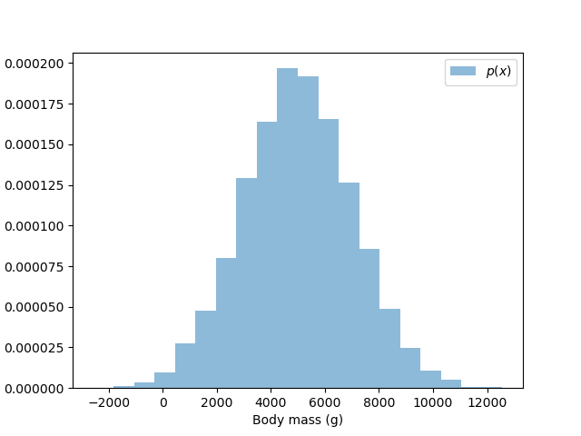
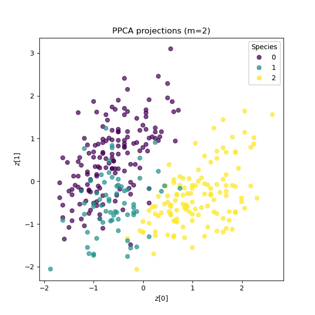
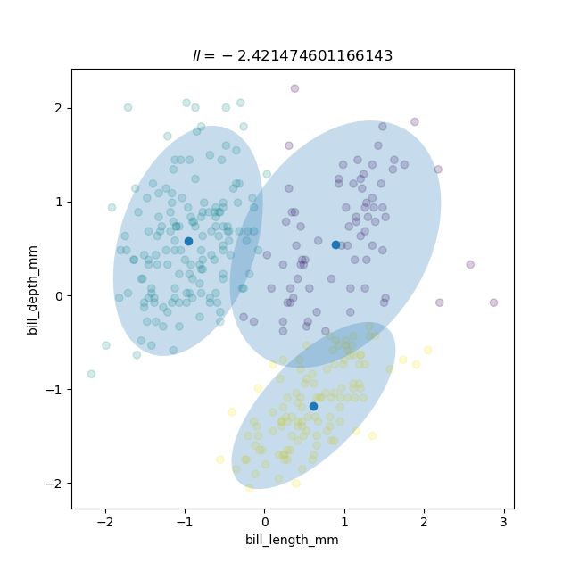
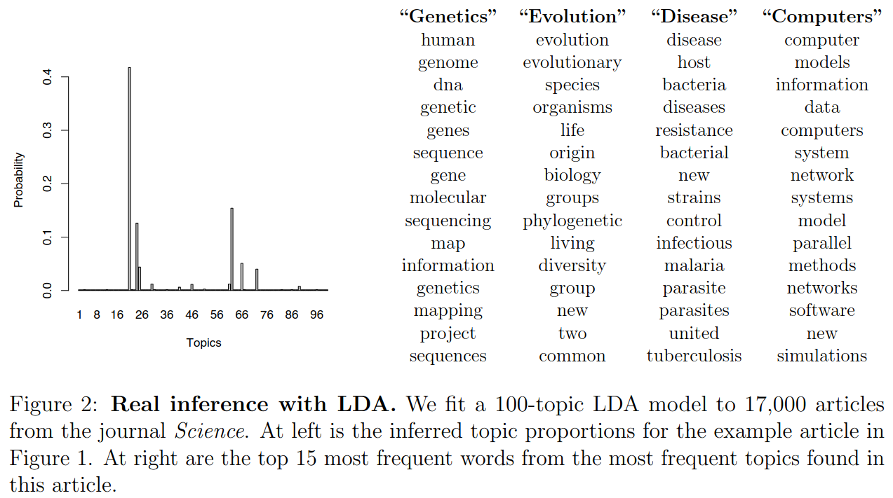

class: middle, center, title-slide

# Foundations of Data Science

Lecture 4: Latent variable models

  
Prof. Gilles Louppe 
[g.louppe@uliege.be](g.louppe@uliege.be)

---

class: middle

.center.width-40[]

In Lecture 2, our exploratory data analysis revealed that penguins are clustered by species, with distinctive physical traits. 

.question[What if we had not been given the species labels? What underlying factors might explain the observed variations in physical traits?]

---

class: middle

# Probabilistic modeling of data

---

class: middle

Data are recorded observations about the world. Mathematically, we can think of data as resulting from a function $f$ that maps real-world entities $\omega$ to measurements $x$,
$$f : \Omega \to \mathcal{X},$$
where
- $\Omega$ is the sample space (the set of all possible entities, accounting for all sources of variability),
- $\mathcal{X}$ is the measurement space.

Entities $\omega \in \Omega$ are not observable, only their measurements $x = f(\omega) \in \mathcal{X}$ are.

---

class: middle

If the sample space $\Omega$ is equipped with a probability function $p$, then the data $x = f(\omega)$ can be viewed as a random variable with distribution induced by $p$, $$x \sim p\_r(x) = \int_{\omega \in \Omega} p(\omega) \delta(x - f(\omega)) d\omega,$$ where $\delta$ is the Dirac delta function.

We call $p\_{r}(x)$ the .bold[data generating process] or the data distribution, where $r$ stands for "real".

---

class: middle

A .bold[parametric probabilistic model] encodes assumptions about how data are generated. It is specified by a parametric family 
$$\mathcal{P} = \\{ p(x \mid \theta) : \theta \in \Theta \\},$$
where $p(x \mid \theta)$ is a probability distribution over $\mathcal{X}$, $\theta$ are parameters, and $\Theta$ is the parameter space.

---

class: middle

.alert[$p(x \mid \theta)$ is not the data distribution $p\_{r}(x)$, only a model of it! There is no such thing as a .italic[true] parameter $\theta$.]

---

class: middle

.center.width-10[]

Example: Body masses of penguins could be modeled as
$$p(x \mid \mu, \sigma^2) = \mathcal{N}(x \mid \mu, \sigma^2),$$
where the parameters are $\theta = (\mu, \sigma^2)$, with $\mu \in \mathbb{R}$ and $\sigma^2 > 0$.

This would assume
- body masses cluster around a central value $\mu$,
- variability is symmetric and controlled by $\sigma^2$,
- extreme values are rare (body masses are normally distributed).

---

class: middle

.center.width-80[]

---

class: middle

## Frequentist inference

In the Frequentist framework, $\theta$ is treated as an unknown but fixed quantity to be estimated from observed data $x\_\text{obs}$. The data are assumed to be generated from the model for some unknown parameter value $\theta^\*$,
$$x\_\text{obs} \sim p(x \mid \theta^\*).$$

Fitting the model to data consists in finding a point estimate $\hat{\theta}$ of $\theta^\*$ (or a confidence region thereof) that best explains the observed data.

---

class: middle

## Bayesian inference

In the Bayesian framework, $\theta$ is treated as a random variable with prior distribution $p(\theta)$ encoding beliefs about plausible parameter values before observing any data.

A .bold[Bayesian model] therefore specifies a joint distribution over data and parameters,
$$p(x, \theta) = p(x \mid \theta) p(\theta),$$
where 
- $p(x \mid \theta)$ is the likelihood,
- $p(\theta)$ is the prior over parameters.

---

class: middle

Fitting a Bayesian model to observed data $x\_\text{obs}$ consists in computing the posterior distribution of the parameters given the data. Using Bayes' rule,
$$p(\theta \mid x\_\text{obs}) = \frac{p(x\_\text{obs} \mid \theta) p(\theta)}{p(x\_\text{obs})}.$$

Depending on the structure of the model, this computation may be easy, difficult, or even intractable.

---

class: middle

## Prior predictive checks

Often, the forward model $p(x | \theta)$ is understood, but the prior $p(\theta)$ is more subjective and harder to justify.

The consequences of prior choices in the context of the generative model can be assessed through .bold[prior predictive checks], which involve simulating data from the model using only the prior distributions, without conditioning on any observed data.

---

class: middle

The prior predictive distribution is given by
$$p(x) = \int p(x | \theta) p(\theta) d\theta.$$

This distribution defines the data that we expect to observe under the model assumptions encoded in the prior. It should be examined to ensure that it aligns with domain knowledge and expectations about the data.

---

class: middle

$$\begin{aligned}
p(\mu, \sigma^2) &= \mathcal{N}(\mu | 5000, 2000^2) \times \text{Uniform}(\sigma^2 | 0, 100) \\\\
p(x | \mu, \sigma^2) &= \mathcal{N}(x | \mu, \sigma^2)
\end{aligned}$$

.center.width-80[]

---

class: middle

# Latent variable models

---

class: middle

## Joint distribution

A .bold[latent variable model] is a probabilistic model that assumes unobserved (latent) variables $z$ that mediate the relationship between observed data $x$ and model parameters $\theta$.

It specifies a joint distribution over observed variables, latent variables, and parameters,
$$p(x, z, \theta) = p(x \mid z, \theta) p(z \mid \theta) p(\theta),$$
where $x$ is the observed data, $z$ are the latent variables, and $\theta$ are the parameters.

---

class: middle

More generally, for a dataset of $N$ observations $\\{ x\_1, \ldots, x\_N \\}$, a latent variable model specifies a joint distribution
$$p(x\_{1:N}, z\_{1:N}, \theta) = \left( \prod\_{i=1}^N p(x\_i \mid z\_i, \theta) p(z\_i \mid \theta) \right) p(\theta),$$
where $z\_i$ are the latent variables associated with observation $x\_i$.

The factorization assumes that each observation $x\_i$ is mediated by its own latent variable $z\_i$, and that observations are conditionally independent given their latent variables and the parameters. All are governed by shared parameters $\theta$.

---

class: middle

## Graphical model representation

Latent variable models can be represented using graphical models, where nodes represent variables (observed, latent, or parameters) and edges represent (possible) dependencies between them.

The graphical model illustrates the structure of the factorization of the joint distribution and the flow of the generative process.

---

class: middle

.center[]

$$p(x\_{1:3}, z\_{1:3}, \theta) = \left( \prod\_{n=1}^3 p(x\_n \mid z\_n) p(z\_n \mid \theta) \right) p(\theta)$$

Shaded nodes represent observed variables, unshaded nodes represent latent variables or parameters.

---

class: middle

.center[]

.center[Plate notation can be used to compactly represent  repeated structures in the graphical model.] 

???

Here, the plate around $x\_n$ and $z\_n$ indicates that these variables are repeated $N$ times, for $i = 1, \ldots, N$.

---

class: middle

## Hyperparameters

Conditional distributions in a latent variable model may depend on additional parameters called .bold[hyperparameters], denoted $\alpha, \beta, \ldots$. These are assumed to be fixed nonrandom quantities$^1$.

For instance, the prior distribution of parameters may depend on hyperparameters,
$$p(\theta \mid \alpha),$$
or the prior distribution of latent variables may depend on hyperparameters,
$$p(z \mid \theta, \beta).$$

.footnote[1: Estimating hyperparameters from data is possible and will be discussed later in the course.]

---

class: middle

.center[]

.center[Small squares denote fixed hyperparameters.]

---

class: middle

## Inference

Fitting a latent variable model to observed data $x\_\text{obs}$ consists in computing the posterior distribution of latent variables and parameters given the data. Using Bayes' rule,
$$p(z, \theta \mid x\_\text{obs}) = \frac{p(x\_\text{obs} \mid z, \theta) p(z \mid \theta) p(\theta)}{p(x\_\text{obs})}.$$

The posterior distribution is used to examine the particular hidden structure that is manifested in the observed data. It can also be used to make predictions about new, unseen data, through the posterior predictive distribution,
$$p(x\_\text{new} \mid x\_\text{obs}) = \iint p(x\_\text{new} \mid z, \theta) p(z, \theta \mid x\_\text{obs}) dz d\theta.$$

---

class: middle

## Example 1: (Probabilistic) PCA 

In probabilistic PCA, each observation $x\_i \in \mathbb{R}^d$ is assumed to be generated from a lower-dimensional latent variable $z\_i \in \mathbb{R}^m$ through a linear transformation plus Gaussian noise.

.center[]

---

class: middle

The joint distribution $p(z, x | B, \mu, \sigma^2)$ factorizes as $p(z) p(x | z, B, \mu, \sigma^2)$, where
- $p(z) = \mathcal{N}(z | 0, I)$ assumes latent variables are standard Gaussian,
- $p(x | z, B, \mu, \sigma^2) = \mathcal{N}(x | Bz + \mu, \sigma^2 I)$ assumes a linear Gaussian observation model, with $B \in \mathbb{R}^{d \times m}$ the loading matrix, $\mu \in \mathbb{R}^d$ the mean vector, and $\sigma^2$ the noise variance.

Therefore, using Gaussian identities, the joint distribution is Gaussian and can be written as
$$p(z, x | B, \mu, \sigma^2) = \mathcal{N}\left(\begin{bmatrix} z \\\\ x \end{bmatrix} | \begin{bmatrix} 0 \\\\ \mu \end{bmatrix}, \begin{bmatrix} I & B^T \\\\ B & BB^T + \sigma^2 I \end{bmatrix}\right).$$

---

class: middle

The posterior distribution $p(z | x, B, \mu, \sigma^2)$ is also Gaussian,
$$p(z | x, B, \mu, \sigma^2) = \mathcal{N}(z | m, C),$$
where
- $m = B^T (BB^T + \sigma^2 I)^{-1} (x - \mu)$ is the posterior mean,
- $C = I - B^T (BB^T + \sigma^2 I)^{-1} B$ is the posterior covariance.

---

class: middle

When $\sigma^2 \to 0$, 
- $m = B^T (BB^T + \sigma^2 I)^{-1} (x - \mu) \to B^T (B B^T)^{-1} (x - \mu)$. If the columns of $B$ are orthonormal, then $B^T (B B^T)^{-1} = B^T$, so $m \to B^T (x - \mu)$, which corresponds to the PCA projection of $x$ onto the subspace spanned by the columns of $B$.
- $C = I - B^T (BB^T + \sigma^2 I)^{-1} B \to I - B^T (B B^T)^{-1} B$. If the columns of $B$ are orthonormal, then $B^T B = I$, so $C \to 0$, indicating that the posterior distribution collapses to a point mass at the PCA projection.

.alert[Probabilistic PCA recovers classical PCA in the limit of vanishing noise!]

---

class: middle

The hyperparameters $B, \mu, \sigma^2$ can be estimated from data $x\_{1:N}$ using maximum (marginal) likelihood estimation,
$$(\hat{B}, \hat{\mu}, \hat{\sigma}^2) = \arg\max\_{B, \mu, \sigma^2} \prod\_{i=1}^N p(x\_i | B, \mu, \sigma^2),$$
where $p(x | B, \mu, \sigma^2) = \int p(x | z, B, \mu, \sigma^2) p(z) dz$ is the marginal likelihood.

Since the joint distribution is Gaussian, the marginal likelihood is also Gaussian,
$$p(x | B, \mu, \sigma^2) = \mathcal{N}(x | \mu, BB^T + \sigma^2 I).$$

---

class: middle

Therefore, writing $BB^T + \sigma^2 I = \Sigma$, maximum likelihood estimation reduces to
$$\begin{aligned}
(\hat{B}, \hat{\mu}, \hat{\sigma}^2) &= \arg\max\_{B, \mu, \sigma^2} \prod\_{i=1}^N \mathcal{N}(x\_i | \mu, \Sigma) \\\\
&= \arg\min\_{B, \mu, \sigma^2} \sum\_{i=1}^N (x\_i - \mu)^T \Sigma^{-1} (x\_i - \mu) + N \log |\Sigma| \\\\
&= \arg\min\_{B, \mu, \sigma^2} N \text{tr}(\Sigma^{-1} S) + N \log |\Sigma|,
\end{aligned}$$
where $S = \frac{1}{N} \sum\_{i=1}^N (x\_i - \mu)(x\_i - \mu)^T$ is the sample covariance matrix.

The solution can be derived in closed form, yielding
- $\hat{\mu} = \frac{1}{N} \sum\_{i=1}^N x\_i$ (the sample mean),
- $\hat{B} = U\_m (\Lambda\_m - \hat{\sigma}^2 I)^{1/2} R$, where $U\_m$ are the top $m$ eigenvectors of $S$, $\Lambda\_m$ are the corresponding eigenvalues, and $R$ is an arbitrary rotation matrix,
- $\hat{\sigma}^2 = \frac{1}{d - m} \sum\_{j=m+1}^d \lambda_j$, where $\lambda\_j$ are the eigenvalues of $S$.

???

Intuitive explanation for the solution:
- $\hat{\mu}$ is the sample mean because it minimizes the squared deviations from the mean. This appears in the log-likelihood as the term $(x\_i - \mu)^T \Sigma^{-1} (x\_i - \mu)$.
- $\hat{B}$ is related to the top $m$ eigenvectors of $S$ because these directions capture the most variance in the data. The term $\text{tr}(\Sigma^{-1} S)$ in the log-likelihood encourages $\Sigma$ to align with the directions of high variance in $S$.
- $\hat{\sigma}^2$ is the average of the remaining eigenvalues because it represents the isotropic noise variance that accounts for the variance not captured by the top $m$ components. The term $\log |\Sigma|$ in the log-likelihood penalizes overly complex models, leading to a balance between fitting the data and maintaining a reasonable noise level.

---

class: middle

.center.width-80[]

---

class: middle

.center.width-10[]

Deriving PCA from a latent variable model provides a .bold[probabilistic interpretation of PCA projections as the most likely latent variables that could have generated the observed data]. 

It also enables direct extensions such as
- Independent Component Analysis (ICA), which assumes non-Gaussian latent variables,
- Factor Analysis, which assumes a more general noise covariance structure,
- Bayesian PCA, which places a prior distribution over the hyperparameters.

---

class: middle

## Example 2: Mixture models

Mixture models assume that data are generated from a mixture of several underlying distributions, each corresponding to a different cluster or component.

.center[]

---

class: middle

For a Gaussian mixture model with $K$ components, each observation $x\_i \in \mathbb{R}^d$ is assumed to be generated by first selecting a component $z\_i \in \\{1, \ldots, K\\}$ according to a categorical distribution, then sampling $x\_i$ from a Gaussian distribution associated with that component.

The joint distribution $p(\theta, z\_{1:N}, x\_{1:N}, \mu\_{1:K}, \sigma^2\_{1:K} | \alpha, \sigma^2\_\mu, \sigma^2\_\sigma)$ factorizes as 
$$p(\theta | \alpha) \prod\_{k=1}^K p(\mu\_k | \sigma^2\_\mu) p(\sigma^2\_k | \sigma^2\_\sigma) \prod\_{i=1}^N p(z\_i | \theta) p(x\_i | z\_i, \mu\_{z\_i}, \sigma^2\_{z\_i}),$$
where
- $p(\theta | \alpha) = \text{Dirichlet}(\alpha)$ is the prior over mixture weights,
- $p(\mu\_k | \sigma^2\_\mu) = \mathcal{N}(0, \sigma^2\_\mu I)$ is the prior over component means,
- $p(\sigma^2\_k | \sigma^2\_\sigma) = \text{Lognormal}(0, \sigma^2\_\sigma)$ is the prior over component variances,
- $p(z\_i | \theta) = \text{Categorical}(\theta)$ is the categorical distribution over components,
- $p(x\_i | z\_i, \mu\_{z\_i}, \sigma^2\_{z\_i}) = \mathcal{N}(\mu\_{z\_i}, \sigma^2\_{z\_i} I)$ is the Gaussian observation model.

---

class: middle

Computing the posterior distribution $p(\theta, z\_{1:N}, \mu\_{1:K}, \sigma^2\_{1:K} | x\_{1:N}, \alpha, \sigma^2\_\mu, \sigma^2\_\sigma)$ amounts to solving a clustering problem, where each component corresponds to a cluster and the latent variables $z\_i$ indicate cluster membership of each observation.

The posterior is typically intractable, requiring approximate inference methods such as Expectation-Maximization (EM) or Variational Inference (VI).

???

Again, deriving clustering from a latent variable model provides a probabilistic interpretation of cluster assignments as the most likely latent variables that could have generated the observed data. Its provides a principled narrative with explicit assumptions rather than a mere algorithmic recipe.

---

class: middle

.center.width-80[]

---

class: middle

## Example 3: Mixed membership models

Nested sets of latent variables can also be used to model more complex generative structures. 

---

class: middle

For instance, in mixed membership models of text documents (.bold[latent dirichlet allocation]), each document is assumed to be generated from a mixture of topics, where each topic is characterized by a distribution over words.

.center[]

???

- K is the number of topics,
- M is the number of documents,
- N is the number of words in a document,
- $\theta\_m$ are the topic proportions for document $m$,
- $z\_{m,n}$ is the topic assignment for word $n$ in document $m$,
- $x\_{m,n}$ is the observed word.

---

class: middle

Posterior inference in mixed membership models can be used to discover the underlying topics in a corpus of documents and to infer the topic proportions for each document.

???

Again, deriving topic modeling from a latent variable model provides a probabilistic interpretation of topics and document-topic proportions as the most likely latent variables that could have generated the observed data.

---

class: middle

.center.width-100[]

.footnote[Credits: [Blei](https://www.eecis.udel.edu/~shatkay/Course/papers/UIntrotoTopicModelsBlei2011-5.pdf), 2011.]

---

class: middle

.center.width-100[]

.footnote[Credits: [Blei](https://www.eecis.udel.edu/~shatkay/Course/papers/UIntrotoTopicModelsBlei2011-5.pdf), 2011.]

---

class: end-slide, center
count: false

The end.

---

class: middle

## Cheat sheet for Gaussian models (Särkkä, 2013)

If $\mathbf{x}$ and $\mathbf{y}$ have the joint Gaussian distribution 
$$
\begin{aligned}
p\left(\begin{matrix}
\mathbf{x} \\\\
\mathbf{y} 
\end{matrix}\right) = \mathcal{N}\left( \left(\begin{matrix}
\mathbf{x} \\\\
\mathbf{y} 
\end{matrix}\right) \bigg\vert \left(\begin{matrix}
\mathbf{a} \\\\
\mathbf{b} 
\end{matrix}\right), \left(\begin{matrix}
\mathbf{A} & \mathbf{C} \\\\
\mathbf{C}^T & \mathbf{B}
\end{matrix}\right) \right),
\end{aligned}
$$
then the marginal and conditional distributions of $\mathbf{x}$ and $\mathbf{y}$ are given by
$$
\begin{aligned}
p(\mathbf{x}) &= \mathcal{N}(\mathbf{x}|\mathbf{a}, \mathbf{A}) \\\\
p(\mathbf{y}) &= \mathcal{N}(\mathbf{y}|\mathbf{b}, \mathbf{B}) \\\\
p(\mathbf{x}|\mathbf{y}) &= \mathcal{N}(\mathbf{x}|\mathbf{a}+\mathbf{C}\mathbf{B}^{-1}(\mathbf{y}-\mathbf{b}), \mathbf{A}-\mathbf{C}\mathbf{B}^{-1}\mathbf{C}^T) \\\\
p(\mathbf{y}|\mathbf{x}) &= \mathcal{N}(\mathbf{y}|\mathbf{b}+\mathbf{C}^T\mathbf{A}^{-1}(\mathbf{x} - \mathbf{a}) , \mathbf{B}-\mathbf{C}^T\mathbf{A}^{-1}\mathbf{C}).
\end{aligned}
$$

---

class: middle

If the random variables $\mathbf{x}$ and $\mathbf{y}$ have Gaussian probability distributions
$$
\begin{aligned}
p(\mathbf{x}) &= \mathcal{N}(\mathbf{x}|\mathbf{m}, \mathbf{P}) \\\\
p(\mathbf{y}|\mathbf{x}) &= \mathcal{N}(\mathbf{y}|\mathbf{H}\mathbf{x}+\mathbf{u}, \mathbf{R}),
\end{aligned}
$$
then the joint distribution of $\mathbf{x}$ and $\mathbf{y}$ is Gaussian with
$$
\begin{aligned}
p\left(\begin{matrix}
\mathbf{x} \\\\
\mathbf{y} 
\end{matrix}\right) = \mathcal{N}\left( \left(\begin{matrix}
\mathbf{x} \\\\
\mathbf{y} 
\end{matrix}\right) \bigg\vert \left(\begin{matrix}
\mathbf{m} \\\\
\mathbf{H}\mathbf{m}+\mathbf{u} 
\end{matrix}\right), \left(\begin{matrix}
\mathbf{P} & \mathbf{P}\mathbf{H}^T \\\\
\mathbf{H}\mathbf{P} & \mathbf{H}\mathbf{P}\mathbf{H}^T + \mathbf{R} 
\end{matrix}\right) \right).
\end{aligned}
$$

